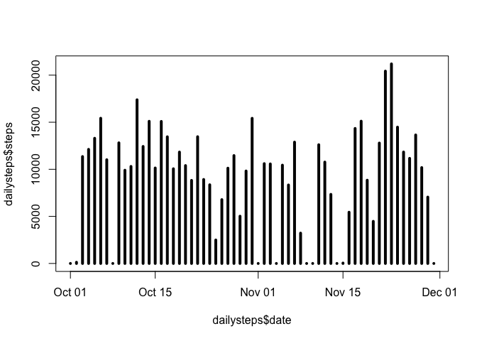
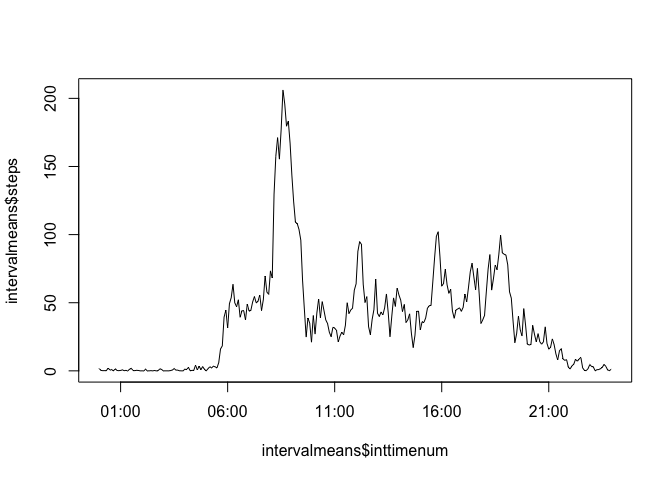
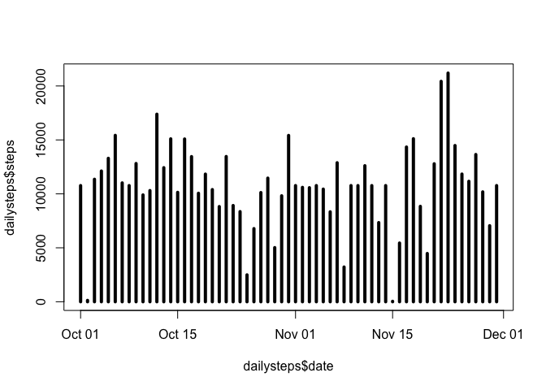
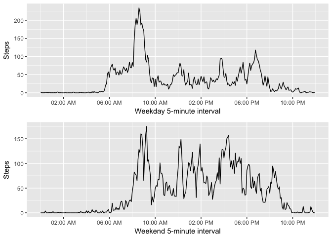

## Reproducible Research Week 2 Peer Rev Project

## Bullet point #1

Here the dataset is located, read, and stored locally as a file to pull from for
the subsequent operations:

```r
temp <- tempfile()
download.file("https://d396qusza40orc.cloudfront.net/repdata%2Fdata%2Factivity.zip",temp)
unzip(temp)
unlink(temp)
```

## Bullet point #2

Here the dataset sums steps over the associated day:

```r
df<-read.csv("activity.csv")

#sum steps in a day and create a new table using lapply
library(data.table)
```

```
## Warning: package 'data.table' was built under R version 3.3.2
```

```r
dtdf<-data.table(df)
dailysteps<-dtdf[, lapply(.SD, sum, na.rm=TRUE), by = date,.SDcols = "steps"]

#convert dailysteps$date to a numeric vector
library(lubridate)
```

```
## 
## Attaching package: 'lubridate'
```

```
## The following objects are masked from 'package:data.table':
## 
##     hour, isoweek, mday, minute, month, quarter, second, wday,
##     week, yday, year
```

```
## The following object is masked from 'package:base':
## 
##     date
```

```r
library(dplyr)
```

```
## -------------------------------------------------------------------------
```

```
## data.table + dplyr code now lives in dtplyr.
## Please library(dtplyr)!
```

```
## -------------------------------------------------------------------------
```

```
## 
## Attaching package: 'dplyr'
```

```
## The following objects are masked from 'package:lubridate':
## 
##     intersect, setdiff, union
```

```
## The following objects are masked from 'package:data.table':
## 
##     between, first, last
```

```
## The following objects are masked from 'package:stats':
## 
##     filter, lag
```

```
## The following objects are masked from 'package:base':
## 
##     intersect, setdiff, setequal, union
```

```r
dailysteps<-mutate(dailysteps, date=ymd(date))

#plot dates vs steps as histograms
plot(dailysteps$date,dailysteps$steps,type="h",lwd=4)
```

<!-- -->

## Bullet point #3

Calculating the mean and median steps per day:

```r
df<-read.csv("activity.csv")

#mean steps in a day and create a new table using lapply
library(data.table)
dtdf<-data.table(df)
dailysteps<-dtdf[, lapply(.SD, sum, na.rm=TRUE), by = date,.SDcols = "steps"]

#calculate mean and median of steps per day
mean(dailysteps$steps)
```

```
## [1] 9354.23
```

```r
median(dailysteps$steps)
```

```
## [1] 10395
```

## Bullet point #4

Plotting the steps for each 5-minute interval:

```r
df<-read.csv("activity.csv")

library(data.table)
dtdf<-data.table(df)
library(ggplot2)
```

```
## Warning: package 'ggplot2' was built under R version 3.3.2
```

```r
#calculate mean steps for each interval and create a new table
intervalmeans<-dtdf[, lapply(.SD, mean, na.rm=TRUE), 
                    by = interval,.SDcols = "steps"]

inttime <- c(intervalmeans$interval)
inttime4d <- sprintf("%04d", inttime)
inttimehhmm<-format(strptime(inttime4d, format="%H%M"), format = "%H:%M")
inttimenum<-as.POSIXct(inttimehhmm,format="%H:%M")
intervalmeans<-cbind(inttimenum,intervalmeans)

#plot the mean steps vs the interval in line form for visual clarity
plot(intervalmeans$inttimenum,intervalmeans$steps,type = "l")
```

<!-- -->

## Bullet point #5

Finding the 5-minute interval that is associate with most steps:

```r
df<-read.csv("activity.csv")

library(data.table)
dtdf<-data.table(df)

#calculate sum of steps for each interval and create a new table
intervalsums<-dtdf[, lapply(.SD, sum, na.rm=TRUE), 
                   by = interval,.SDcols = "steps"]

#find max value
max(intervalsums,na.rm=TRUE)
```

```
## [1] 10927
```

```r
#grep row with max value
grep(10927,intervalsums$steps)
```

```
## [1] 104
```

```r
#find row with max value
intervalsums[104,]
```

```
##    interval steps
## 1:      835 10927
```

```r
#max interval is 835 (this person gets in a morning walk/run)
```

## Bullet point #6

Calculating mean steps after excluding NA values:

```r
df<-read.csv("activity.csv")

#convert to data table
library(data.table)
dtdf<-data.table(df)

#calculate mean steps per 5 minutes without missing values
NAsteps<-is.na(dtdf$steps)
mean(dtdf$steps[!NAsteps])
```

```
## [1] 37.3826
```

```r
#mean steps per 5 minutes are 37.3826

#replacing NA values with mean of 37.3826
dtdf$steps[is.na(dtdf$steps)] <- 37.3826
```

## Bullet point #7

A plot with mean daily steps replacing NA values:

```r
df<-read.csv("activity.csv")

#convert to data table
library(data.table)
dtdf<-data.table(df)

#calculate mean steps per 5 minutes without missing values
NAsteps<-is.na(dtdf$steps)
mean(dtdf$steps[!NAsteps])
```

```
## [1] 37.3826
```

```r
#mean steps per 5 minutes are 37.3826

#replacing NA values with mean of 37.3826
dtdf$steps[is.na(dtdf$steps)] <- 37.3826

#sum steps in a day and create a new table using lapply
dailysteps<-dtdf[, lapply(.SD, sum, na.rm=TRUE), by = date,.SDcols = "steps"]

#convert dailysteps$date to a numeric vector
library(lubridate)
library(dplyr)
dailysteps<-mutate(dailysteps, date=ymd(date))

#plot dates vs steps as histograms
plot(dailysteps$date,dailysteps$steps,type="h",lwd=4)
```

<!-- -->

## Bullet point #8

A panel plot showing both weekend and weekday 5-minute interval steps:

```r
df<-read.csv("activity.csv")

library(data.table)
dtdf<-data.table(df)

#assign days of week and convert character time to numeric time vector
library(lubridate)
inttime <- c(dtdf$interval)
inttime4d <- sprintf("%04d", inttime)
inttimehhmm<-format(strptime(inttime4d, format="%H%M"), format = "%H:%M")
inttimenum<-as.POSIXct(inttimehhmm,format="%H:%M")
dtdf<-cbind(inttimenum,dtdf)

#add weekday column to data table
library(dplyr)
weekdaydtdf<-cbind(weekday=weekdays(ymd(dtdf$date)),dtdf)
WEdtdf<-gsub("Saturday|Sunday","Weekend",weekdaydtdf$weekday)
Fin<-cbind(
        Seg=gsub(
                "Monday|Tuesday|Wednesday|Thursday|Friday","Weekday",
                WEdtdf),weekdaydtdf)

weekday<-subset(Fin,Seg=="Weekday")
weekend<-subset(Fin,Seg=="Weekend")

#calculate mean steps for each interval and create a new table
imweekday<-cbind(weekday[, lapply(.SD, mean, na.rm=TRUE), 
                    by = interval,.SDcols = "steps"],weekday)
imweekend<-cbind(weekend[, lapply(.SD, mean, na.rm=TRUE), 
                             by = interval,.SDcols = "steps"],weekend)


#plot the mean steps vs the interval in line form for visual clarity
library(ggplot2)
library(grid)


plot1p1<-ggplot(imweekday,aes(inttimenum,steps))+geom_line()+
        scale_x_datetime(date_breaks = "4 hour",date_labels = "%I:%M %p")+
        labs(x="Weekday 5-minute interval",y="Steps")

plot1p2<-ggplot(imweekend,aes(inttimenum,steps))+geom_line()+
        scale_x_datetime(date_breaks = "4 hour",date_labels = "%I:%M %p")+
        labs(x="Weekend 5-minute interval",y="Steps")

grid.newpage()
pushViewport(viewport(layout = grid.layout(2, 1)))    
print(plot1p1, vp = viewport(layout.pos.row = 1, layout.pos.col = 1))      
print(plot1p2, vp = viewport(layout.pos.row = 2, layout.pos.col = 1))
```

<!-- -->
